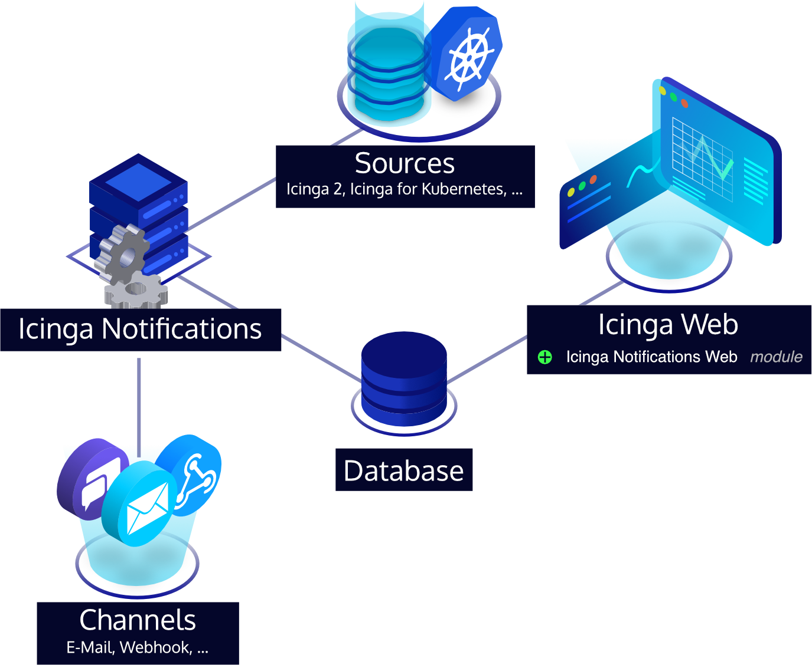

# Icinga Notifications Web

> [!WARNING]
> This is an early beta version for you to try, but do not use this in production. There may still be severe bugs.
> 
> At the moment, we don't provide any support for this module.

Icinga Notifications is a set of components that processes received events from various sources, manages incidents and
forwards notifications to predefined contacts, consisting of:

* [Icinga Notifications](https://github.com/Icinga/icinga-notifications), which receives events and sends notifications.
* Icinga Notifications Web, which provides graphical configuration.

Icinga 2 itself and miscellaneous other sources propagate state updates and other events to [Icinga Notifications](https://github.com/Icinga/icinga-notifications).

## Big Picture

Because Icinga Notifications consists of several components,
this section tries to help understand how these components relate.

First, the Icinga Notifications configuration resides in a SQL database.
It can be conveniently tweaked via Icinga Notifications Web directly from a web browser.
The Icinga Notifications daemon uses this database to read the current configuration.

As in any Icinga setup, all host and service checks are defined in Icinga 2.
By querying the Icinga 2 API, the Icinga Notifications daemon retrieves state changes, acknowledgements and other events.
These events are stored in the database and are available for further inspection in Icinga Notifications Web.
Next to Icinga 2, other notification sources can be configured.

Depending on its configuration, the daemon will take action on these events.
This optionally includes escalations that are sent through a channel plugin.
Each of those channel plugins implements a domain-specific transport, e.g., the `email` channel sends emails via SMTP.
When configured, Icinga Notifications will use channel plugins to notify end users or talk to other APIs.

## Available Channels

Icinga Notifications comes with multiple channels out of the box:

* _email_: Email submission via SMTP
* _rocketchat_: Rocket.Chat
* _webhook_: Configurable HTTP/HTTPS queries for third-party backends

Additional custom channels can be developed independently of Icinga Notifications,
following the [channel specification](https://icinga.com/docs/icinga-notifications/latest/doc/10-Channels).

## Documentation

Icinga Notifications Web documentation is available at [icinga.com/docs](https://icinga.com/docs/icinga-notifications-web/latest).

## License

Icinga Notifications Web and its documentation are licensed under the terms of the [GNU General Public License Version 2](LICENSE).
