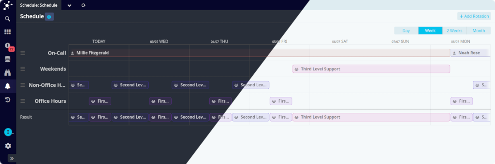

# Icinga Notifications Web

!!! warning
This is an early beta version for you to try, but do not use this in production. There may still be severe bugs.
At the moment, we don't provide any support for this module.

Icinga Notifications is a set of components that processes received events from miscellaneous sources, manages
incidents and forwards notifications to predefined contacts, consisting of:

* [Icinga Notifications](https://github.com/Icinga/icinga-notifications), which receives events and sends
  notifications.
* Icinga Notifications Web, which provides graphical configuration.

Icinga 2 and any other sources propagate state updates and other events to the [Icinga Notifications
Daemon](https://github.com/Icinga/icinga-notifications).

## Installation

To install Icinga Notifications Web see [Installation](02-Installation.md).

## License

Icinga Notifications and the Icinga Notifications documentation are licensed under the terms of the
GNU General Public License Version 2.
