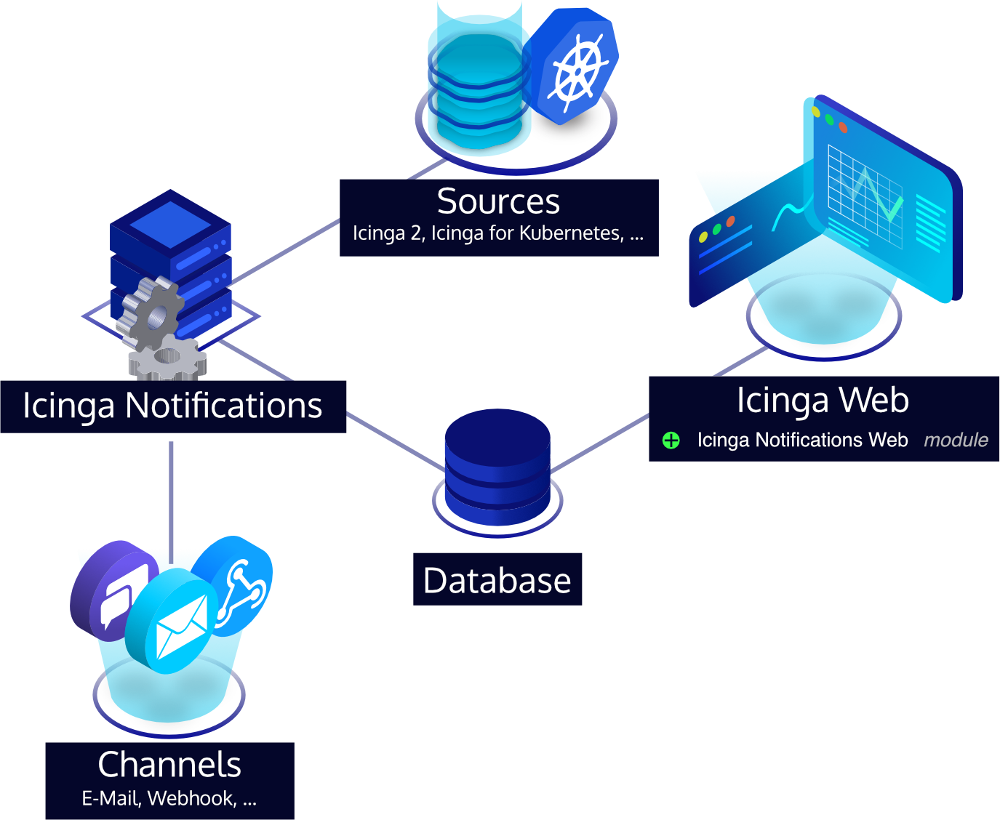

# Icinga Notifications Web

!!! warning

    This is an early preview version for you to try, but do not use this in production.
    There may still be severe bugs and incompatible changes may happen without any notice.
    At the moment, we don't yet provide any support for this.

Icinga Notifications is a set of components that processes received events from various sources, manages
incidents and forwards notifications to predefined contacts. The components are:

* [Icinga Notifications](https://github.com/Icinga/icinga-notifications), which receives events and sends notifications.
* Icinga Notifications Web, which lets users configure Icinga Notifications and manage incidents.

Icinga 2 itself and other sources propagate state updates and other events to [Icinga Notifications](https://github.com/Icinga/icinga-notifications).

## Big Picture

All configuration of Icinga Notifications is done via Icinga Notifications Web. This includes the setup of sources
Icinga Notifications will receive events from. To set up a source, an accompanying integration in Icinga Web is
required. At the moment, compatible integrations are available for:

* Icinga 2, by using Icinga DB as backend

Icinga Notifications receives events from the configured sources and decides whether to open an incident and when to
forward them to which recipients. Icinga Notifications Web allows configuring these rules and managing incidents. To
send notifications, Icinga Notifications is able to facilitate various types of channels, e.g., email, Rocket.Chat,
webhook, etc.

## Available Channels

The following channels are currently available out of the box:

* _email_: Email submission via SMTP
* _rocketchat_: Rocket.Chat
* _webhook_: Configurable HTTP/HTTPS queries for third-party backends

Additional custom channels can be developed independently of Icinga Notifications,
following the [channel specification](https://icinga.com/docs/icinga-notifications/latest/doc/10-Channels).

## Installation

To install Icinga Notifications Web, see [Installation](02-Installation.md).

## License

Icinga Notifications Web and its documentation are licensed under the terms of the [GNU General Public License Version 2](https://github.com/Icinga/icinga-notifications-web?tab=GPL-2.0-1-ov-file#readme).
