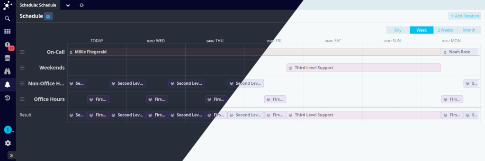

# Configuration

If Icinga Web has been installed but not yet set up, please visit Icinga Web and follow the web-based setup wizard.
For Icinga Web setups already running, log in to Icinga Web with a privileged user and follow the steps below to
configure Icinga Notifications Web:

<!--  -->

## Module Activation

If you just installed the module, do not forget to activate it on your Icinga Web instance(s) by using your
preferred way:

- Use Icinga Web's command-line interface on the webserver(s) and execute `icingacli module enable notifications`.
- Visit Icinga Web, log in as a privileged user and activate the module under `Configuration →
  Modules → notifications` by switching the state from `disabled` to `enabled`.

<!--  -->

## Database Configuration

Connection configuration for the database, which both,
[Icinga Notifications](https://github.com/Icinga/icinga-notifications) and [Icinga Notifications Web](https://github.com/Icinga/icinga-notifications-web), use.

!!! tip

    If not already done, initialize your database by following the [instructions](https://icinga.com/docs/icinga-notifications/latest/doc/02-Installation#setting-up-the-database).

1. Create a new resource for the Icinga Notifications database via the `Configuration → Application → Resources` menu.
2. Configure the resource you just created as the database connection for the Icinga Notifications Web module using the
   `Configuration → Modules → notifications → Database` menu.

## Channels Configuration

As the Icinga Notifications daemon notifies contacts in case of events and incidents, you need to configure appropriate 
communication channels.

The currently supported channels can be found [here](01-About.md#available-channels).

They can be configured through `Configuration → Modules → notifications → Channels` and the credentials to be supplied 
might differ depending on the channel type.

You need to configure at least one valid communication channel to be able to supply your contacts with notifications.

## Sources Configuration

The notifications module operates on data fed by miscellaneous sources and is therefore not restricted to Icinga 2 only.
Consult the source specific documentation on how to integrate such.

You need to provide at least one valid source for this module to function properly.

### Adding an Icinga 2 source

!!! tip

    If there is no API user with the required permissions yet, read through [Icinga's API documentation](https://icinga.com/docs/icinga-2/latest/doc/12-icinga2-api/#authentication).

    The API user needs the following [permissions](https://icinga.com/docs/icinga-2/latest/doc/12-icinga2-api/#overview):

    - `events/*`

    - `objects/query/*`

If you want the notifications module to process Icinga 2 events, you will need to add it as a source:

1. Navigate to `Configuration → Module → notifications → Sources` and add a new source.
2. Choose type `Icinga` and provide the Icinga 2 API credentials.
3. (Optional) Disable `Verify API Certificate` if you want
   [Icinga Notifications](https://icinga.com/docs/icinga-notifications/latest) to skip its check for the certificate
   validity of the given REST API endpoint.
