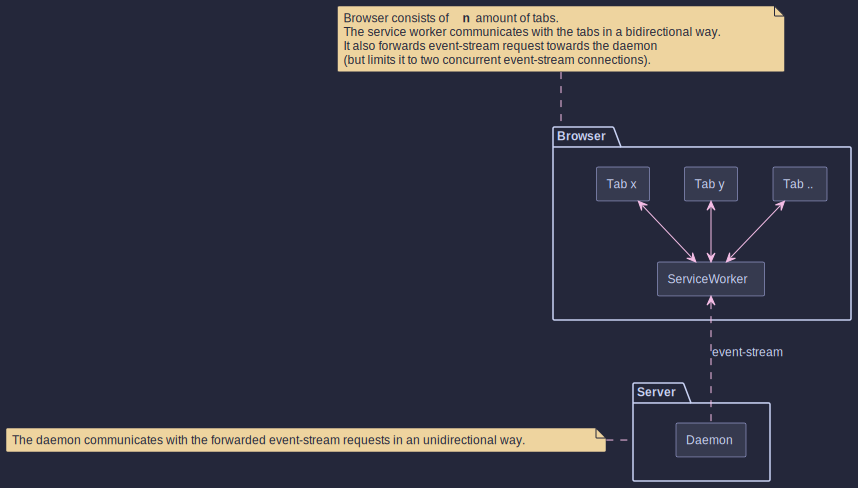

#  Notifications (JS module, service worker)

## Architecture

The desktop notification feature interacts with a service worker. The following illustration shows the architectural
structure of the feature:

The individual browser tabs essentially send their requests through the service worker, which then decides whether to
block the request or if it should forward it to the daemon.
In case the request gets forwarded to the daemon, the service worker injects itself between the daemon and the
browser tab by piping the readable stream. It can thus react to stream abortions from both sides.

## Why the stream injection?

The service worker needs to be able to decide on whether to open up new event-streams or not. If Icinga 2 would only
target desktop devices, it could just use JavaScript's `beforeunload/unload`
events ([check this](https://www.igvita.com/2015/11/20/dont-lose-user-and-app-state-use-page-visibility/)).

Mobile devices unfortunately behave a little different, and they might not trigger those events while putting the tab in
the background or while freezing it (battery saving features; happens after a while when the phone gets locked).

The `visibilitychange` event on the other hand, works as intended - even on mobile devices. But it's pretty much
impossible for JavaScript to differentiate between a browser hiding a tab, a tab freeze (as the browser gets put into
the background) or a tab kill.

As the browser should ideally be constantly connected to the daemon through two event-streams, the service worker
has to know when an event-stream closes down.
